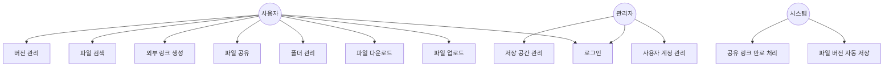
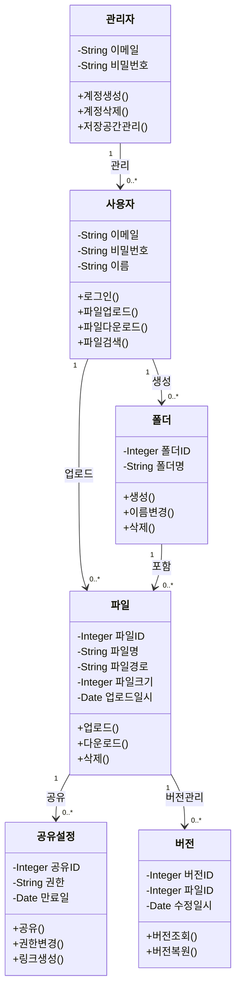
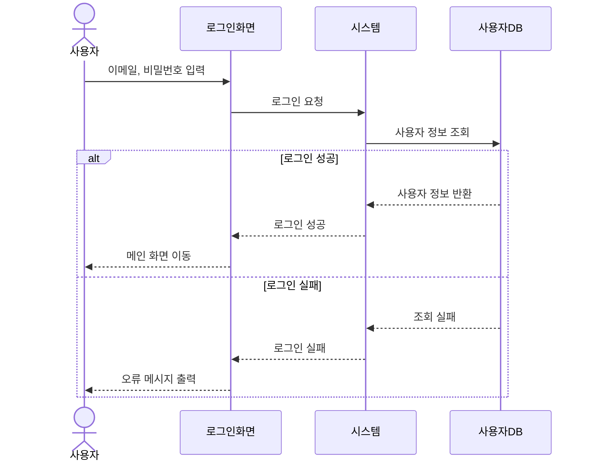
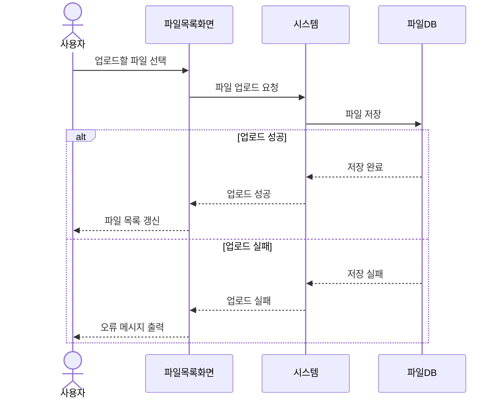
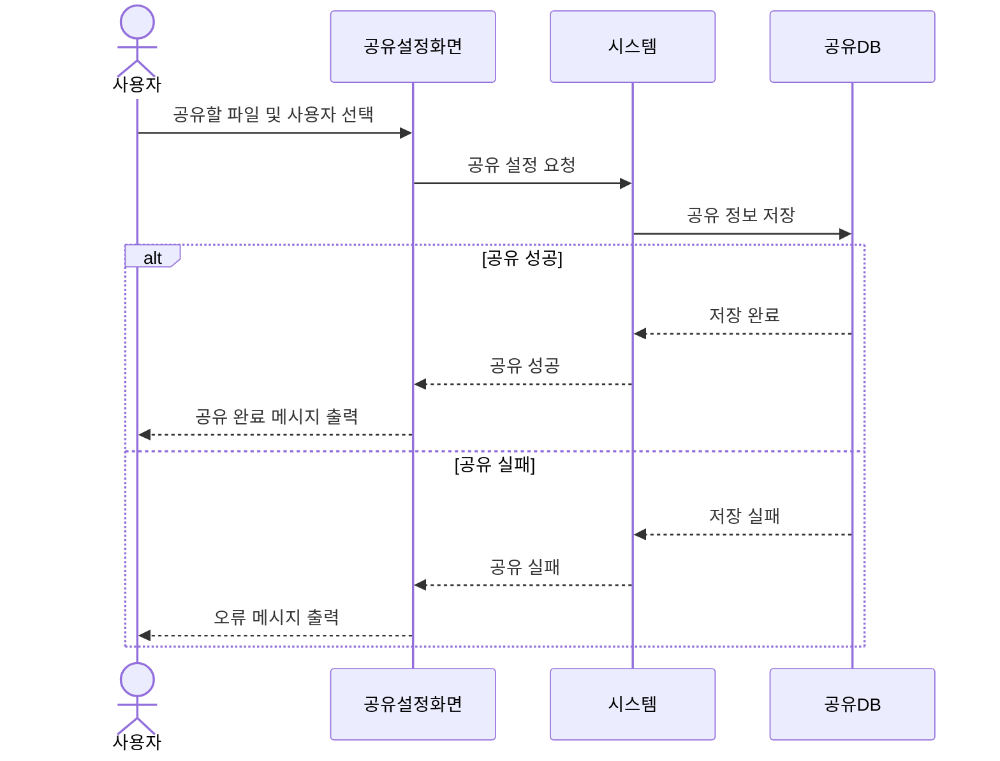
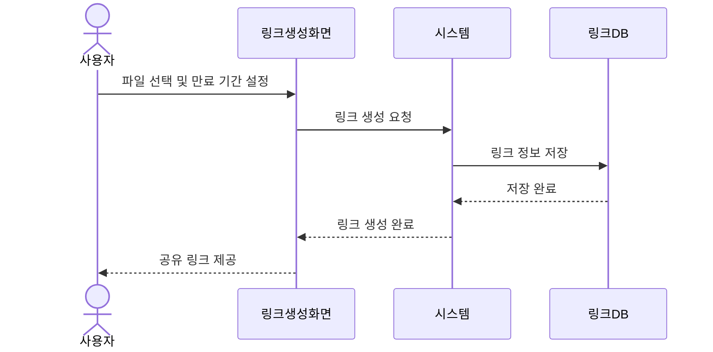
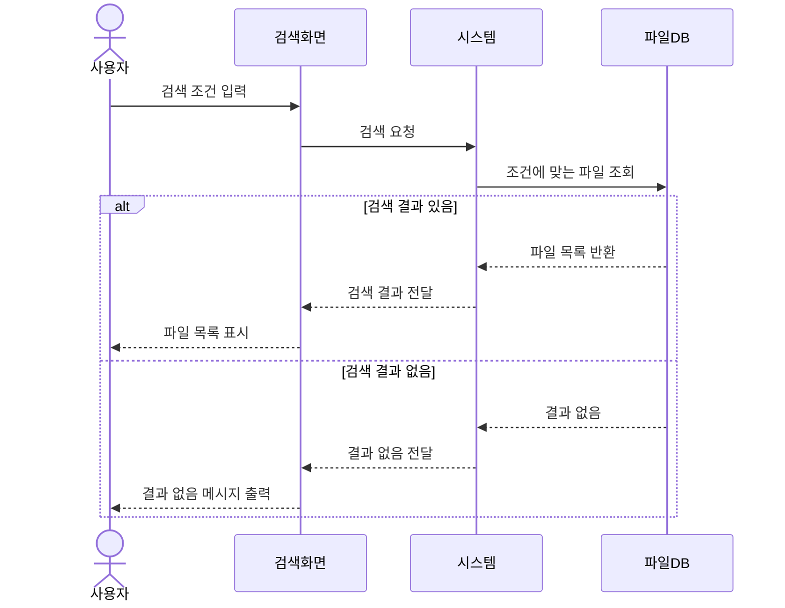

# 요구사항 분석서

## 1. 서론

### 1.1 목적 및 범위

본 문서는 클라우드 파일 공유 시스템 **Mini Drive**에 대하여 기능 관점, 구조 관점, 행위 관점의 요구사항 분석을 수행하고 그 결과를 정리한 문서이다.

본 문서는 다음과 같은 내용을 포함한다.

- 기능 관점: 유스케이스 다이어그램 및 유스케이스 설명서
- 구조 관점: 클래스 다이어그램
- 행위 관점: 순차 다이어그램

### 1.2 용어 정의

| 용어 | 설명 |
|---|---|
| Mini Drive | 본 프로젝트에서 개발하는 클라우드 파일 공유 시스템 |
| 사용자 | Mini Drive에 로그인하여 파일을 관리하고 공유하는 조직 구성원 |
| 관리자 | 시스템 전반의 사용자 계정 및 저장 공간을 관리하는 담당자 |
| 유스케이스 | 시스템이 사용자에게 제공하는 기능 단위 |
| 클래스 다이어그램 | 시스템의 구조를 클래스와 관계로 표현한 다이어그램 |
| 순차 다이어그램 | 시스템의 동작을 시간 순서에 따라 표현한 다이어그램 |

### 1.3 참조 문서

- 요구사항 정의서: `doc/3.requirements.md`
- 프로젝트 관리 계획서: `doc/2.project_management_plan.md`

---

## 2. 시스템 개요

### 2.1 Actor Table

| Actor | Role |
|---|---|
| 사용자 | Mini Drive에 로그인하여 파일을 업로드, 다운로드, 검색, 공유하는 조직 구성원 |
| 관리자 | 사용자 계정을 생성/삭제하고 저장 공간을 관리하는 담당자 |
| 시스템 | 파일 저장, 버전 관리, 공유 링크 만료 등을 자동으로 처리하는 주체 |

---

### 2.2 유스케이스 다이어그램

---

### 2.3 유스케이스 설명서

#### U_01 로그인

| 항목 | 내용 |
|---|---|
| Use Case Name | 로그인을 한다 |
| ID | U_01 |
| Primary Actor | 사용자, 관리자 |
| 설명 | 사용자 또는 관리자가 이메일과 비밀번호로 시스템에 로그인한다 |
| Trigger | 로그인 버튼을 누른다 |
| 정상 흐름 | 1. 이메일과 비밀번호를 입력한다 / 2. 로그인 버튼을 누른다 / 3. 시스템은 메인 화면으로 이동한다 |
| 예외 흐름 | 비밀번호가 틀린 경우 로그인 실패 메시지를 출력한다 |

#### U_02 파일 업로드

| 항목 | 내용 |
|---|---|
| Use Case Name | 파일을 업로드한다 |
| ID | U_02 |
| Primary Actor | 사용자 |
| 설명 | 사용자가 업무 파일을 시스템에 업로드한다 |
| Trigger | 업로드 버튼을 누른다 |
| 정상 흐름 | 1. 업로드할 파일을 선택한다 / 2. 업로드 버튼을 누른다 / 3. 시스템은 파일을 저장하고 목록에 표시한다 |
| 예외 흐름 | 파일 크기 초과 시 업로드 실패 메시지를 출력한다 |

#### U_03 파일 다운로드

| 항목 | 내용 |
|---|---|
| Use Case Name | 파일을 다운로드한다 |
| ID | U_03 |
| Primary Actor | 사용자 |
| 설명 | 사용자가 저장된 파일을 다운로드한다 |
| Trigger | 다운로드 버튼을 누른다 |
| 정상 흐름 | 1. 다운로드할 파일을 선택한다 / 2. 다운로드 버튼을 누른다 / 3. 시스템은 파일을 사용자 기기에 저장한다 |
| 예외 흐름 | 권한이 없는 경우 다운로드 불가 메시지를 출력한다 |

#### U_04 폴더 관리

| 항목 | 내용 |
|---|---|
| Use Case Name | 폴더를 관리한다 |
| ID | U_04 |
| Primary Actor | 사용자 |
| 설명 | 사용자가 폴더를 생성, 이름 변경, 삭제하고 파일을 이동한다 |
| Trigger | 폴더 관리 버튼을 누른다 |
| 정상 흐름 | 1. 폴더 생성/수정/삭제 중 하나를 선택한다 / 2. 작업을 수행한다 / 3. 시스템은 변경사항을 반영한다 |
| 예외 흐름 | 삭제할 폴더에 파일이 있는 경우 확인 메시지를 출력한다 |

#### U_05 파일 공유

| 항목 | 내용 |
|---|---|
| Use Case Name | 파일을 공유한다 |
| ID | U_05 |
| Primary Actor | 사용자 |
| 설명 | 사용자가 특정 파일을 다른 사용자와 공유하고 권한을 설정한다 |
| Trigger | 공유 버튼을 누른다 |
| 정상 흐름 | 1. 공유할 파일을 선택한다 / 2. 공유할 사용자를 입력한다 / 3. 권한(보기/수정/댓글)을 설정한다 / 4. 공유 버튼을 누른다 |
| 예외 흐름 | 존재하지 않는 사용자 입력 시 오류 메시지를 출력한다 |

#### U_06 외부 링크 생성

| 항목 | 내용 |
|---|---|
| Use Case Name | 외부 링크를 생성한다 |
| ID | U_06 |
| Primary Actor | 사용자 |
| 설명 | 사용자가 외부 협력자와 파일을 공유하기 위한 링크를 생성한다 |
| Trigger | 링크 생성 버튼을 누른다 |
| 정상 흐름 | 1. 링크를 생성할 파일을 선택한다 / 2. 만료 기간을 설정한다 / 3. 링크 생성 버튼을 누른다 / 4. 시스템은 공유 링크를 생성한다 |
| 예외 흐름 | 만료 기간 미설정 시 기본값으로 설정된다 |

#### U_07 파일 검색

| 항목 | 내용 |
|---|---|
| Use Case Name | 파일을 검색한다 |
| ID | U_07 |
| Primary Actor | 사용자 |
| 설명 | 사용자가 파일명, 날짜, 파일 유형 등을 기준으로 파일을 검색한다 |
| Trigger | 검색창에 검색어를 입력한다 |
| 정상 흐름 | 1. 검색 조건을 입력한다 / 2. 검색 버튼을 누른다 / 3. 시스템은 조건에 맞는 파일 목록을 표시한다 |
| 예외 흐름 | 검색 결과가 없는 경우 결과 없음 메시지를 출력한다 |

#### U_08 버전 관리

| 항목 | 내용 |
|---|---|
| Use Case Name | 버전을 관리한다 |
| ID | U_08 |
| Primary Actor | 사용자 |
| 설명 | 사용자가 파일의 이전 버전을 확인하고 복원한다 |
| Trigger | 버전 관리 버튼을 누른다 |
| 정상 흐름 | 1. 버전을 확인할 파일을 선택한다 / 2. 버전 목록을 확인한다 / 3. 원하는 버전을 선택하여 복원한다 |
| 예외 흐름 | 버전 이력이 없는 경우 이력 없음 메시지를 출력한다 |

#### U_09 사용자 계정 관리

| 항목 | 내용 |
|---|---|
| Use Case Name | 사용자 계정을 관리한다 |
| ID | U_09 |
| Primary Actor | 관리자 |
| 설명 | 관리자가 사용자 계정을 생성하거나 삭제한다 |
| Trigger | 계정 관리 메뉴를 선택한다 |
| 정상 흐름 | 1. 계정 생성 또는 삭제를 선택한다 / 2. 대상 사용자 정보를 입력한다 / 3. 확인 버튼을 누른다 |
| 예외 흐름 | 이미 존재하는 계정 생성 시 오류 메시지를 출력한다 |

---

## 3. 요구사항 명세

### 3.1 클래스 다이어그램 (정적 분석)

---

### 3.2 순차 다이어그램 (동적 분석)

#### 3.2.1 로그인

#### 3.2.2 파일 업로드

#### 3.2.3 파일 공유

#### 3.2.4 외부 링크 생성

#### 3.2.5 파일 검색

---

## 4. 인터페이스 분석

| 화면 | 설명 |
|---|---|
| 로그인 화면 | 이메일과 비밀번호를 입력하여 로그인하는 화면 |
| 파일 목록 화면 | 업로드된 파일과 폴더를 확인하고 관리하는 메인 화면 |
| 파일 공유 화면 | 파일을 특정 사용자와 공유하고 권한을 설정하는 화면 |
| 링크 생성 화면 | 외부 공유 링크를 생성하고 만료 기간을 설정하는 화면 |
| 검색 화면 | 파일명, 날짜, 파일 유형 등으로 파일을 검색하는 화면 |
| 버전 관리 화면 | 파일의 버전 이력을 확인하고 복원하는 화면 |
| 계정 관리 화면 | 관리자가 사용자 계정을 생성하거나 삭제하는 화면 |

---

## 5. 제약사항

| 제약사항 | 내용 |
|---|---|
| 운영 환경 | 웹 브라우저를 통해 접근 가능해야 한다 |
| 사용자 규모 | 약 200명의 조직 구성원을 대상으로 한다 |
| 보안 | 로그인 인증 및 권한 기반 접근 제어를 제공해야 한다 |
| 파일 형식 | 업무에서 사용되는 일반적인 파일 형식을 지원해야 한다 |

---

## 6. 요구사항 추적표

| 요구사항 | U_01 | U_02 | U_03 | U_04 | U_05 | U_06 | U_07 | U_08 | U_09 |
|---|---|---|---|---|---|---|---|---|---|
| FR-001 파일 업로드 | | O | | | | | | | |
| FR-002 파일 다운로드 | | | O | | | | | | |
| FR-003 폴더 생성 | | | | O | | | | | |
| FR-004 파일 이동 | | | | O | | | | | |
| FR-005 파일 공유 | | | | | O | | | | |
| FR-006 권한 설정 | | | | | O | | | | |
| FR-007 외부 링크 생성 | | | | | | O | | | |
| FR-008 링크 만료 설정 | | | | | | O | | | |
| FR-009 파일 검색 | | | | | | | O | | |
| FR-010 버전 조회 | | | | | | | | O | |
| FR-011 버전 복원 | | | | | | | | O | |
| FR-012 계정 생성/삭제 | | | | | | | | | O |
| NFR-001 로그인 인증 | O | | | | | | | | |
| NFR-002 접근 권한 제어 | O | | | | O | O | | | |

---

## 7. 참고문헌 및 부록

- Customer Requirement Document v0.1
- 요구사항 정의서 (`doc/3.requirements.md`)
